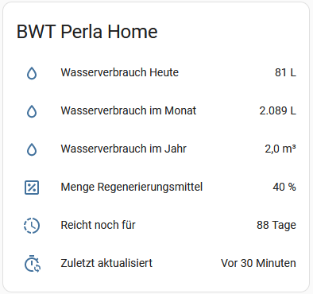

# HA Integration for BWT Perla Home

**A custom component for Home Assistant that delivers data from the water softener BWT Perla Home.**

 

Your BWT Perla Home device needs to be connected with your local Wifi network. You need to know the ip address of your BWT device and your login code.

Following data will be provided:

* [as attribute]		flow today in liter
* [as attribute]		flow in this month in liter
* [as attribute]		flow in this year im m³
* [as attribute]		remaining regeneration agent in %
* [as entity value]		refill regeneration agent in days

## Installation
 * copy the *bwt_perla_home* folder (including files) into *custom_components* folder
 * add sensor entity to configuration.yaml file
 ```bash
 sensor:
 - platform: bwt_perla_home
   name: BWT
   ip_address: 192.168.123.123
   password: "your_password"
   scan_interval: 3600 #in seconds
 ```
 
 * restart home assistant

***Caution:*** for English or other languages you need to change json_response items (in sensor.py).
With the curl commands you can check how the response items named:

```bash
curl -d "_method=POST&STLoginPWField=your_password&function=save" https://192.168.123.123/users/login -c cookie.txt --insecure --verbose
curl -v -b cookie.txt https://192.168.123.123/home/actualizedata --insecure
```

You should receive a response like this:

*{"aktuellerDurchfluss":"0","aktuellerDurchflussProzent":"0","durchflussHeute":"84","durchflussMonat":"2092","durchflussJahr":"20","RegeneriemittelNachfuellenIn":"88","RegeneriemittelVerbleibend":"40"}*

## Best Practice for Dashboard
The [multiple-entity-row](https://github.com/benct/lovelace-multiple-entity-row) card is perfect to display the attributes.
Example code for the card shown above.

```bash
type: entities
title: BWT Perla Home
entities:
  - entity: sensor.bwt
    type: custom:multiple-entity-row
    name: Wasserverbrauch Heute
    show_state: false
    icon: mdi:water-outline
    entities:
      - attribute: flowToday
        unit: L
  - entity: sensor.bwt
    type: custom:multiple-entity-row
    name: Wasserverbrauch im Monat
    show_state: false
    icon: mdi:water-outline
    entities:
      - attribute: flowMonth
        unit: L
  - entity: sensor.bwt
    type: custom:multiple-entity-row
    name: Wasserverbrauch im Jahr
    show_state: false
    icon: mdi:water-outline
    entities:
      - attribute: flowYear
        unit: m³
  - entity: sensor.bwt
    type: custom:multiple-entity-row
    name: Menge Regenerierungsmittel
    show_state: false
    icon: mdi:percent-box-outline
    entities:
      - attribute: remainingRegeneratingAgent
        unit: '%'
  - entity: sensor.bwt
    type: custom:multiple-entity-row
    name: Reicht noch für
    unit: Tage
  - entity: sensor.bwt
    type: custom:multiple-entity-row
    name: Zuletzt aktualisiert
    show_state: false
    icon: mdi:timer-sync-outline
    entities:
      - attribute: last-updated
 ```